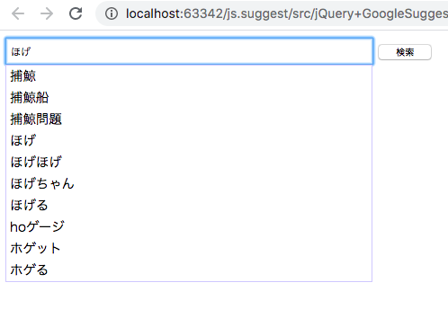
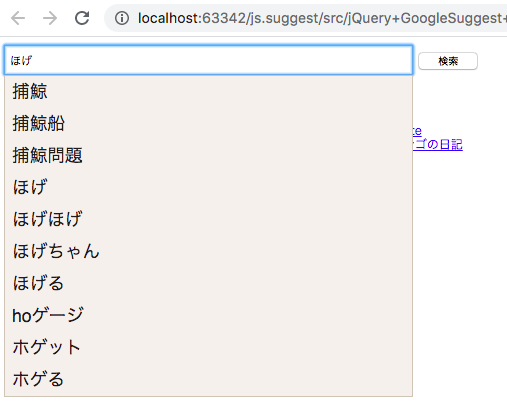
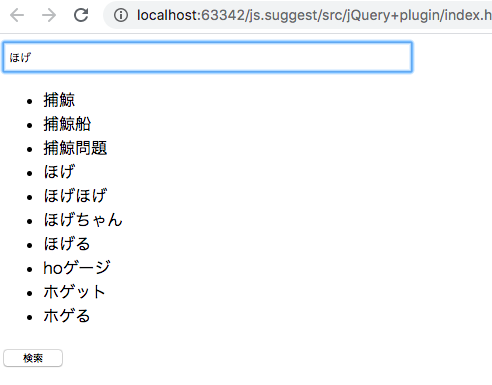

# js.suggest
JavaScriptでサジェスト機能を作ってみる。
※ bitbucketのmercurialのサポート終了に伴い、githubへ移植する  
※ 割と昔のコードです  

## サンプル
- *jQuery＋GoogleSuggest*  

- *jQuery＋GoogleSuggest+jQueryUI*  
  
*[実装条件]*  
  - jQueryの導入 （ 1.3.2以上 ）  
  - [jQueryUIの導入 ( 1.8～1.12 )](https://api.jqueryui.com/autocomplete/)  
  ※ 1.8 : jQuery 1.3.2以上  
  ※ 1.12: jQuery 1.7以上  

- *jQueryプラグイン*  
  

## 参考サイト
- *jQuery＋GoogleSuggest*  
  - [第4回 検索キーワードを提案するSuggest機能の実装](http://gihyo.jp/dev/feature/01/jquery-ajax/0004?page=1)
  
- *jQuery＋GoogleSuggest+jQueryUI*  
  - [Google Autocomplete -API- - Shreyas Chand](http://shreyaschand.com/blog/2013/01/03/google-autocomplete-api/)
  - [jQuery UI 1.11.4 on the Microsoft Ajax CDN - The ASP.NET Site](https://docs.microsoft.com/en-us/aspnet/ajax/cdn/jquery-ui/cdnjqueryui1114)
  - [jQueryでAmazon-Googleのsuggest機能を実装する - タツノオトシゴの日記](http://d.hatena.ne.jp/tatsu-no-toshigo/20140428/1398667460)
